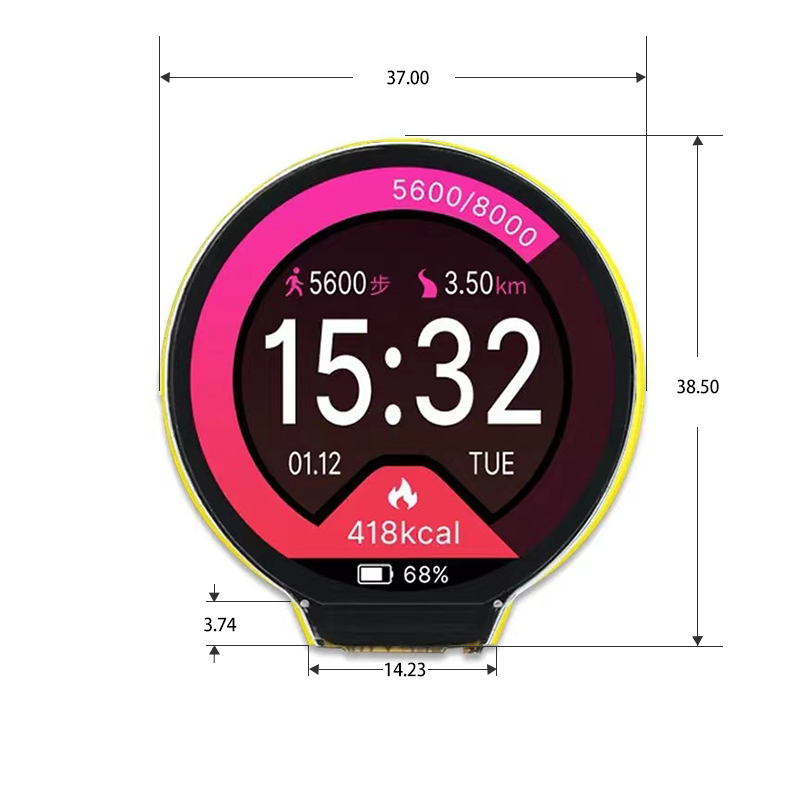

# ESP32 LCD 1.28-Inch UI Project

## 📘 Project Description

This project focuses on building a **graphical user interface (GUI)** on a **1.28-inch LCD display** driven by the **CST816D** controller.
It uses the **LVGL (Light and Versatile Graphics Library)** to render a modern and responsive UI suitable for embedded systems with small displays.

---

## 📁 Project Structure

ESP32_LCD_1_28_Inch/
├── Note/ # Image, Schematic and User manual...of Esp32 LCD 1.28 inch
├── Source/ # Source code of Manufacturer using Arduino IDE and Code using EspIdf (My self)
├── README.md # Project description and instructions

---

## 🔧 Features

- Smooth GUI rendering on 1.28-inch CST816D LCD
- Integration with LVGL for modular and scalable UI development
- Can update new display without resubmitting firmware using XML
---

## 🧰 Tools & Libraries

- **Microcontroller**: ESP32-C3 LCD 1.28 inch (Link: https://www.aliexpress.com/item/1005007169503529.html?spm=a2g0o.order_list.order_list_main.4.4e7a1802OD6Obe)
- **Display**: 1.28" TFT LCD, CST816D controller
- **Graphics Library**: [LVGL](https://lvgl.io/)
- **Development Environment**: VS Code with ESP-IDF

---

🚀 Build & Flash Instructions

👨‍💻 Author
- Truong Van Vu – Embedded Software Engineer
- 📧 Email: [truongvanvuvta1@gmail.com]
- 🔗 GitHub: https://github.com/truongvanvuembedded